# fithub
## Table of Contents

- [Project Goals](#project-goals)
- [Live Project](#live-project)
- [Screenshot](#screenshot)
- [User Stories](#user-stories)
- [Database Models and Schema](#database-models-and-schema)
- [Design](#design)
- [Features](#features)
- [Testing](#testing)
- [Deployment](#deployment)
- [Credits](#credits)
- [Conclusion](#conclusion)

 

## Project Goals 
Fithub is a dynamic fitness web application built with Django, PostgreSQL, and modern front-end technologies. It allows users to explore workout plans, track exercise progress, and access premium content through secure authentication and Stripe integration. The platform is designed with a responsive interface and user-friendly experience, supporting profile management, progress tracking, and communication features. The project follows best practices to deliver a scalable, secure, and fully functional fitness platform.     
 
--- 
## Live Project  
- [View the live project here.](https://fit-hub-e72d29259775.herokuapp.com/) 

## Screenshot  
### Home page screenshot. 

 

    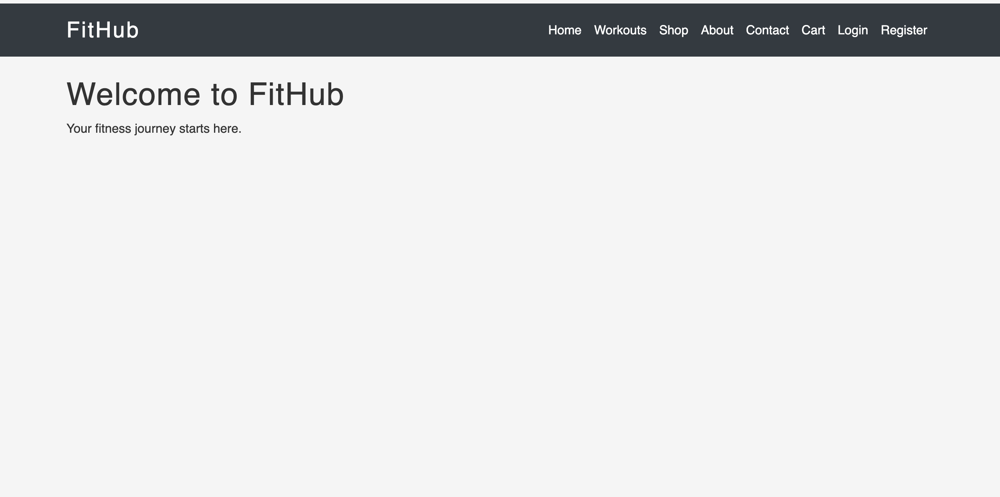

 
## User Stories 
 
### View Workouts Details
   
As a visitor, I want to view a detailed workout plan, So that I can understand the exercises included.
 
**Acceptance Criteria** 
- Acceptance criteria 1: Clicking a workout plan opens the full plan page.
 
- Acceptance criteria 2: The page displays:

    -title

    -difficulty level

    -description

    -list of exercises
- Acceptance criteria 3: Premium workouts show a locked message for non-subscribers.
 
### Access Premium Workouts

As a subscribed user, I want to access premium workouts, So that I can benefit from advanced training plans.
 
**Acceptance Criteria** 
- Acceptance criteria 1: Only users with an active subscription can view premium workouts.
- Acceptance criteria 2: Non-subscribed users see a subscription prompt.
- Acceptance criteria 3: Backend verification prevents bypassing access. 
 
### Subscribe to Premium Plan  
As a registered user, I want to purchase a monthly subscription, So that I can access premium workout plans.
 
**Acceptance Criteria** 
- Acceptance criteria 1: Subscription page displays plan details and price.
- Acceptance criteria 2: Users are redirected to Stripe checkout.
- Acceptance criteria 3: Successful payment activates the subscription.
- Acceptance criteria 4: Premium workout plans become accessible.
 
### Track Workout Completion
As a registered user, I want to mark workouts as completed, So that I can track my fitness progress. 
 
**Acceptance Criteria** 
- Acceptance criteria 1: Users can mark workouts as completed.
- Acceptance criteria 2: Completion status is saved in the database.
- Acceptance criteria 3: Progress displays on the user dashboard.
 
### Login to Account 
As a registered user, I want to log into my account, So that I can access my profile, workouts, and purchases.
 
**Acceptance Criteria** 
- Acceptance criteria 1: Login form is accessible.
- Acceptance criteria 2: Correct credentials log the user in.
- Acceptance criteria 3: nvalid credentials show an error message.
- Acceptance criteria 4: User is redirected to their dashboard or homepage.
 
### View Fitness Progress
As a registered user,   
As a registered user, I want to see my workout progress, So that I can monitor my improvement.
 
**Acceptance Criteria** 
- Acceptance criteria 1: Dashboard displays:

    -Completed workouts

    -Total workouts

    -Completion percentage

- Acceptance criteria 2: Progress updates dynamically.

### Create an Account  
As a visitor, I can register for an account, so that I can track my fitness progress and access premium content. 
 
**Acceptance Criteria** 
- Acceptance criteria 1: Registration form is available.
- Acceptance criteria 2: Valid detail create a new user account.
- Acceptance criteria 3: A profile and Subscription record are automatically created.
- Acceptance criteria 4: Users is redirected to the homepage after successful registration.
 
### Contact Site Owner
As a visitor, I want to contact the platform owner, so that I can ask questions or report issues. 
 
**Acceptance Criteria** 
- Acceptance criteria 1: Contact form is accessible.

- Acceptance criteria 2: Form includes:
    - Name
    - Email
    - Message

- Acceptance criteria 3: Form submission sends the message successfully.
 
### About Page   
As a visitor, I want to learn about the platform, So that I understand what services FitHub offers.
 
**Acceptance Criteria** 
- Acceptance criteria 1: About page is accessible from navigation.
- Acceptance criteria 2: Page describes:

    - Platform purpose

    - Services offered

    - Subscription benefits

- Acceptance criteria 3: Page is responsive and readable on all devices.
 
--- 
### Manage Fitness Profile
As a registered user, I want to update my fitness profile, So that I can personalize my experience.

**Acceptance Criteria** 
- Acceptance criteria 1: Users can update:

    -picture

    -bio

- Acceptance criteria 2: Changes are saved to the database.

- Acceptance criteria 3: Profile updates immediately reflect on the profile page.
 

### Manage Shop Products
As an admin, I want to manage digital products, So that I can sell fitness guides and resources.

**Acceptance Criteria** 
- Acceptance criteria 1: Admin can create products.

- Acceptance criteria 2: Admin can edit or remove products.

- Acceptance criteria 3: Products appear automatically in the shop.

### Manage Workouts
As an admin, I want to create, edit, and delete workout plans, So that I can maintain the site’s content.

**Acceptance Criteria** 
- Acceptance criteria 1: Admin can manage workout plans via Django Admin.
- Acceptance criteria 2: Admin can add exercises to workouts.
- Acceptance criteria 3: Changes are reflected immediately on the site.

### Browse Shop Products
As a visitor, I want to browse fitness products, So that I can purchase workout equipment and guides.

**Acceptance Criteria**
- Acceptance criteria 1: Shop page displays all available products
- Acceptance criteria 2: Products show image, name, price, and stock status
- Acceptance criteria 3: Products are displayed in a responsive grid layout
- Acceptance criteria 4: Users can click on products to view details

### Add Products to Cart
As a user, I want to add products to my cart, So that I can purchase multiple items at once.

**Acceptance Criteria**
- Acceptance criteria 1: Products have an "Add to Cart" button
- Acceptance criteria 2: Cart shows quantity and total price
- Acceptance criteria 3: Users can update or remove items from cart
- Acceptance criteria 4: Cart persists in session for non-logged-in users

### Provide Delivery Address
As a customer, I want to enter my delivery address at checkout, 
So that my purchased items can be shipped to me.

**Acceptance Criteria**
- Acceptance criteria 1: Checkout process includes a delivery information form

- Acceptance criteria 2: Form requires full name, email, phone number, and address

- Acceptance criteria 3: Address fields include street, city, postal code, and country

- Acceptance criteria 5: Delivery information is saved before payment is processed

### View Customer Orders
As an admin, I want to see all customer orders, So that I can process and fulfills them.

**Acceptance Criteria**

- Acceptance criteria 1: Admin can view list of all orders with order numbers

- Acceptance criteria 2: Each order shows customer name, total amount, and date

- Acceptance criteria 5: Order details show which products were purchased

### Database Models and Schema

### Models Overview

#### Authentication & User Management (Django Allauth)

**User** (Built-in Django User Model)
- Fields: username, email, password, is_active, is_staff, date_joined, last_login
- Role: Base user authentication and account management
- Relationships: 
  - One-to-One with UserProfile
  - One-to-Many with Orders
  - One-to-Many with Deliveries

**UserProfile** (profiles/models.py)
- Fields: user, bio, profile_image, is_premium
- Purpose: Extends user with fitness profile information and premium status
- Relationships: Belongs to One User
- Special: Auto-created via Django signals when user registers

**Delivery** (profiles/models.py)
- Fields: user, full_name, email, phone_number, address_line1, address_line2, city, postal_code, country, created_at
- Purpose: Stores customer shipping addresses for product deliveries
- Relationships: Belongs to One User (ForeignKey)
- Features: Full address property method for formatted addresses

#### Shop 

**Product** (shop/models.py)
- Fields: name, description, price, image, stock
- Purpose: Manages fitness products available for purchase
- Features: 
  - Stock tracking for inventory management
  - Image upload support via AWS S3
  - Low stock warnings (admin feature)

**Order** (shop/models.py)
- Fields: user, created_at, total, paid
- Purpose: Tracks customer purchase transactions
- Relationships: 
  - Belongs to One User
  - Has many OrderItems
- Features: Paid status tracking for order fulfillment

**OrderItem** (shop/models.py)
- Fields: order, product, quantity, price
- Purpose: Individual line items within an order
- Relationships: 
  - Belongs to One Order
  - Belongs to One Product
- Features: Captures price at time of purchase (historical record)

#### Workout Management

**Workout** (workouts/models.py)
- Fields: title, description, difficulty, duration, is_premium
- Purpose: Fitness workout plans for users
- Features:
  - is_premium flag for premium content restriction
  - Difficulty levels (Beginner, Intermediate, Advanced)
- Relationships: Has many Exercises

**Exercise** (workouts/models.py)
- Fields: workout, name, sets, reps, duration
- Purpose: Individual exercises within workout plans
- Relationships: Belongs to One Workout

**Progress** (workouts/models.py)
- Fields: user, exercise, completed, completed_at
- Purpose: Tracks user workout completion progress
- Relationships:
  - Belongs to One User
  - Belongs to One Exercise
- Features: Timestamp tracking for completion history

#### Payments & Premium

**Stripe Integration**
- Used for secure payment processing
- Handles checkout sessions and transactions
- Ensures safe handling of payment data

**Functionality:**
- Users can purchase premium access
- Payments are processed securely via Stripe
- Payment status is stored in the database
- Checkout session management
- Secure metadata storage (order_id, user_id)

**Premium Access Control**
- Activated automatically after successful Stripe payment
- Admin can manually grant/revoke premium status

#### Contact & Communication

**Contact Form** (pages app)
- Fields: name, email, message
- Purpose: Customer inquiries and support requests
- Features:
  - Email notification to site owner
  - Auto-reply confirmation to customer
  - Gmail SMTP integration

#### Django Allauth (Authentication System)
- **Purpose**: Complete user authentication management
- **Features**:
  - Handles user authentication workflows
  - Email verification and account management
  - Secure login, logout, and registration
  - Password reset functionality
- **Functionality**:
  - Users can register with email confirmation
  - Secure session management
  - Account recovery options

## WireFrames

  - Phone
    - [Wireframes for phones.](readme-images/wireframes/)
  - Tablet
    - [Wireframes for tablets.](readme-images/wireframes/)
  - Desktop
    - [Wireframes for desktops.](readme-images/wireframes/)

## Database models and schema
### Models Overview

#### Authentication & User Management (Django Allauth)

**User** (Built-in Django User Model)
- Fields: username, email, password, is_active, is_staff, date_joined, last_login
- Role: Base user authentication and account management
- Relationships: 
  - One-to-One with UserProfile
  - One-to-Many with Orders
  - One-to-Many with Deliveries

**UserProfile** (profiles/models.py)
- Fields: user, bio, profile_image, is_premium
- Purpose: Extends user with fitness profile information and premium status
- Relationships: Belongs to One User
- Special: Auto-created via Django signals when user registers

**Delivery** (profiles/models.py)
- Fields: user, full_name, email, phone_number, address_line1, address_line2, city, postal_code, country, created_at
- Purpose: Stores customer shipping addresses for product deliveries
- Relationships: Belongs to One User (ForeignKey)
- Features: Full address property method for formatted addresses

#### Shop 

**Product** (shop/models.py)
- Fields: name, description, price, image, stock
- Purpose: Manages fitness products available for purchase
- Features: 
  - Stock tracking for inventory management
  - Image upload support via AWS S3
  - Low stock warnings (admin feature)

**Order** (shop/models.py)
- Fields: user, created_at, total, paid
- Purpose: Tracks customer purchase transactions
- Relationships: 
  - Belongs to One User
  - Has many OrderItems
- Features: Paid status tracking for order fulfillment

**OrderItem** (shop/models.py)
- Fields: order, product, quantity, price
- Purpose: Individual line items within an order
- Relationships: 
  - Belongs to One Order
  - Belongs to One Product
- Features: Captures price at time of purchase (historical record)

#### Workout Management

**Workout** (workouts/models.py)
- Fields: title, description, difficulty, duration, is_premium
- Purpose: Fitness workout plans for users
- Features:
  - is_premium flag for premium content restriction
  - Difficulty levels (Beginner, Intermediate, Advanced)
- Relationships: Has many Exercises

**Exercise** (workouts/models.py)
- Fields: workout, name, sets, reps, duration
- Purpose: Individual exercises within workout plans
- Relationships: Belongs to One Workout

**Progress** (workouts/models.py)
- Fields: user, exercise, completed, completed_at
- Purpose: Tracks user workout completion progress
- Relationships:
  - Belongs to One User
  - Belongs to One Exercise
- Features: Timestamp tracking for completion history

#### Payments & Premium

**Stripe Integration**
- Used for secure payment processing
- Handles checkout sessions and transactions
- Ensures safe handling of payment data

**Functionality:**
- Users can purchase premium access
- Payments are processed securely via Stripe
- Payment status is stored in the database
- Checkout session management
- Webhook handling for payment confirmation
- Secure metadata storage (order_id, user_id)

**Premium Access Control**
- Managed via UserProfile.is_premium boolean
- Activated automatically after successful Stripe payment
- Admin can manually grant/revoke premium status

#### Contact 

**Contact Form** (pages app)
- Fields: name, email, message
- Purpose: Customer inquiries and support requests
- Features:
  - Email notification to site owner
  - Auto-reply confirmation to customer
  - Gmail SMTP integration

#### Stripe API
- **Purpose**: Secure payment processing for premium subscriptions and product purchases
- **Features**:
  - Checkout session creation and management
  - Secure payment intent handling
  - Payment confirmation and verification
- **Functionality**:
  - Users can purchase premium access
  - Users can buy physical products
  - Payments are processed securely via Stripe
  - Payment status is stored in the database
  - Order confirmation after successful payment

#### Django Allauth (Authentication System)
- **Purpose**: Complete user authentication management
- **Features**:
  - Handles user authentication workflows
  - Email verification and account management
  - Secure login, logout, and registration
  - Password reset functionality
  - Social account integration (optional)
- **Functionality**:
  - Users can register with email confirmation
  - Secure session management
  - Account recovery options

## Design

### Colour Scheme

The platform uses a custom colour palette defined in CSS variables for consistency and easy maintenance.

**Primary Colours:**
- **Primary Red (`#ff4d4d`)** : Used for all primary buttons (Add to Cart, Checkout, Upgrade) and hover states on navigation links. This energetic red reinforces the fitness brand identity.
- **Dark Background (`#1f1f1f`)** : Applied to the navbar, creating a strong, modern contrast against the content area.
- **Accent Light Grey (`#f5f5f5`)** : Serves as the main background colour for the body, reducing eye strain and providing a clean canvas for content.

**Functional & Feedback Colours:**
- **Success Green:** Used for positive indicators, stock availability messages, and successful action confirmations (via Bootstrap alert classes).
- **Danger Red (`#dc3545`)** : Used for error messages, stock warnings when inventory is low, and destructive actions like removing items from the cart.

**Text Colours:**
- **Text Dark (`#333`)** : Primary text colour for body content, ensuring high readability.
- **Text Muted (`#6c757d`)** : Used for secondary information and form placeholders (via Bootstrap).

### Typography

The platform employs a hybrid font strategy combining a modern sans-serif body font with a bold display font for headings.

**Font Stack:**
- **Body Text:** `'Montserrat', sans-serif` - Clean, modern, and highly readable across all devices
- **Headings:** `'Bebas Neue', sans-serif` - Bold, impactful letter-spacing for H1-H4 tags

**Images**
- Workout-related imagery genrated using using Grok.
- Clean and minimal design
- Responsive scaling

**Icons**

The platform uses **Font Awesome 6** icons extensively throughout the interface to improve visual communication and user interaction.

**Navigation Icons:**
| Link | Icon | Purpose |
|------|------|---------|
| Home | `fa-home` | Returns to homepage |
| Workouts | `fa-dumbbell` | Access fitness plans |
| Shop | `fa-store` | Browse fitness products |
| About | `fa-info-circle` | Learn about FitHub |
| Contact | `fa-envelope` | Send inquiries |
| Cart | `fa-shopping-cart` | View shopping cart |

**User Action Icons:**
| Action | Icon | Purpose |
|--------|------|---------|
| Profile | `fa-user` | View user profile |
| Login | `fa-sign-in-alt` | Sign into account |
| Logout | `fa-sign-out-alt` | Sign out of account |
| Register | `fa-user-plus` | Create new account |

**Cart & Checkout Icons:**
| Action | Icon | Purpose |
|--------|------|---------|
| Add to Cart | `fa-shopping-cart` | Add product to cart |
| Remove Item | `fa-trash` | Delete cart item |
| Increase Quantity | `fa-plus` | Add one more unit |
| Decrease Quantity | `fa-minus` | Remove one unit |

**Premium & Feedback Icons:**
| Element | Icon | Purpose |
|---------|------|---------|
| Premium Feature | `fa-crown` | Indicates premium content |
| Success Message | `fa-check-circle` | Confirms successful action |
| Error Message | `fa-exclamation-triangle` | Alerts user to errors |
| Info Message | `fa-info-circle` | Provides helpful information |
| Warning Message | `fa-exclamation-circle` | Warns about important issues |

**Progress Indicators:**
| Indicator | Icon | Purpose |
|-----------|------|---------|
| Workout Progress | `fa-chart-line` | Shows fitness journey progress |
| Loading State | `fa-spinner fa-spin` | Indicates AJAX processing |
| Stock Status | `fa-check-circle` / `fa-times-circle` | Shows product availability |
| Payment Processing | `fa-credit-card` | Indicates Stripe checkout |

## Features  

### Home app

- **Hero Section**

    - Upon opening the site, the user is greeted with a vibrant hero section that clearly defines FitHub as a fitness platform.
    - The hero section features a gradient background (purple to blue) with white text for high contrast.
    - Two call-to-action buttons are prominently displayed: "Start Working Out" and "Shop Now".
    - The hero section encourages users to begin their fitness journey immediately.

    

        
    

- **Features Section**
    - Three feature cards explain the core benefits of FitHub:
        - **Workout Plans:** Access premium and free workout plans designed by fitness experts
        - **Track Progress:** Monitor your fitness journey and celebrate achievements
        - **Premium Access:** Unlock exclusive content with premium subscription
    - Each card includes a Font Awesome icon (dumbbell, chart-line, crown) for visual appeal
    - Cards have hover effects with shadow for interactive feedback

    

        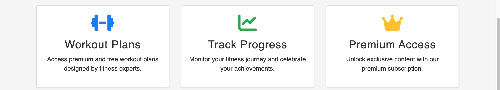
    

- **Featured Products**
    - The homepage displays up to 2 featured products from the shop database
    - Each product card shows: image, name, price, and "View Details" button
    - Products are fetched dynamically from the Product model
    - Empty state message appears when no products are available
    - "View All Products" button links to the full shop page

    

        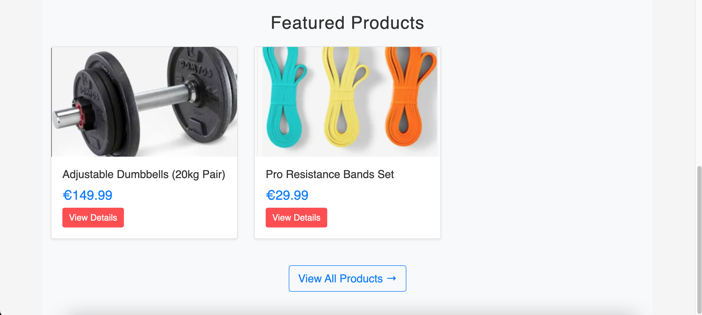
    

- **Premium Call-to-Action**
    - Section promotes premium subscription to non-premium users only
    - Shows €19.99/month pricing with list of benefits
    - "Upgrade Now" button links to Stripe checkout
    - **Conditional Display:** Hidden completely for users who already have premium access
    - Guest users see the upgrade prompt with login option

    

        
    

- **Navigation System**
    - Fixed navbar with dark background (`#1f1f1f`) and brand logo
    - Font Awesome icons on all navigation links for improved visual recognition
    - Navigation links include: Home, Workouts, Shop, About, Contact, Cart 
    - User-specific links: Profile/Logout (logged in) or Login/Register (guests)
    - Responsive navbar collapses to hamburger menu on mobile devices

    

        
    

- **Interactive Elements**
    - All buttons have hover effects with colour transitions
    - Primary buttons use brand red (`#ff4d4d`) with darker hover state
    - Cards have subtle shadow effects that elevate on hover
    - Loading states during AJAX requests (cart updates)
    - Success/error messages auto-dismiss after 3 seconds

- **Responsive Design**
    - Mobile-first approach using Bootstrap 4.6 grid system
    - Cards stack vertically on screens under 768px
    - Hero section text and buttons adjust spacing on mobile
    - Navigation collapses to hamburger menu with toggle button
    - Images scale appropriately across all device sizes

    

        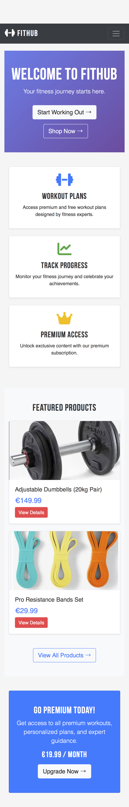
    

- **Dynamic Content**
    - Featured products automatically update when new products are added to shop
    - Premium CTA intelligently hides for existing premium members
    - User-specific navigation shows different options based on authentication status
    - Messages display for user actions (add to cart, login required, etc.)

- **Performance Optimizations**
    - Only 2 featured products queried to minimize database load
    - Images use `object-fit: cover` for consistent sizing
    - Bootstrap CDN for faster loading
    - Font Awesome icons loaded via CDN
    - Custom CSS minimal and optimized

- **Accessibility Features**
    - High contrast text on gradient hero section
    - Alt text on all product images
    - Semantic HTML structure
    - Keyboard navigable links and buttons
    - ARIA labels on icon-only elements

- **Future Enhancements**
    - Newsletter signup section (planned)
    - Blog preview showing latest posts (planned)
    - Testimonials section from premium members (planned)
    - Workout progress preview for logged-in users (planned)
    - Animated counters for user statistics (planned)

### Workout app

#### View All Workouts
- Users can browse all available workout plans from the navigation menu
- Workouts are displayed in a responsive card grid layout
- Each workout card shows title, difficulty level, duration, and premium status
- Premium workouts are clearly marked with a crown icon for non-subscribers

    

#### Detailed Workout Pages
- Clicking any workout opens a detailed page with complete information
- Page displays: title, description, difficulty level, duration, and exercise list
- Premium workouts show a locked message for non-premium users
- Premium users see full exercise details with sets and reps

    

#### Exercises with Sets and Reps
- Each workout contains multiple exercises
- Exercises display name, sets, reps, and duration
- Users can mark individual exercises as complete
- Completion status is saved to user profile

#### Premium Workout Restriction
- Premium workouts are only accessible to users with active subscription
- Non-premium users see upgrade prompt with link to premium checkout
- Backend verification prevents URL bypass attempts
- Premium status is checked on every workout access

    

---

### Progress Tracking

#### Mark Exercises as Complete
- Registered users can check off exercises as they complete them
- Checkboxes provide instant visual feedback
- Completion status is saved to database immediately

#### Stored Per User
- Each user has their own progress tracking
- Progress data persists across sessions
- Users can see their completed workouts history

#### Dynamic Updates
- Progress updates without page refresh (AJAX)
- Dashboard shows real-time completion percentage
- Visual indicators show progress at a glance

    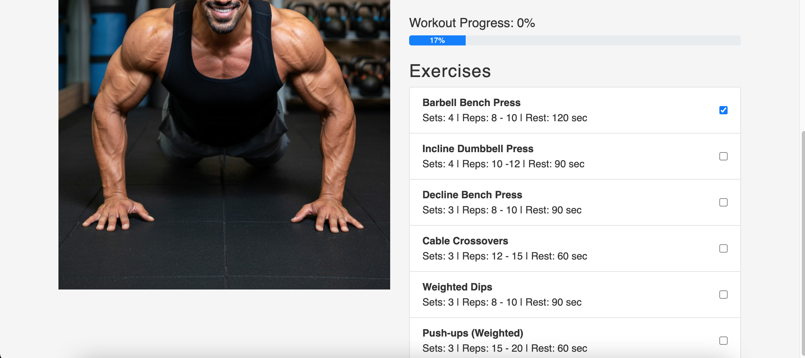

---

### Authentication System (Django Allauth)

#### Registration and Login
- Users can create accounts with email and password
- Registration form validates input and creates user profile automatically
- Login form with remember me option
- Password reset functionality via email

    
    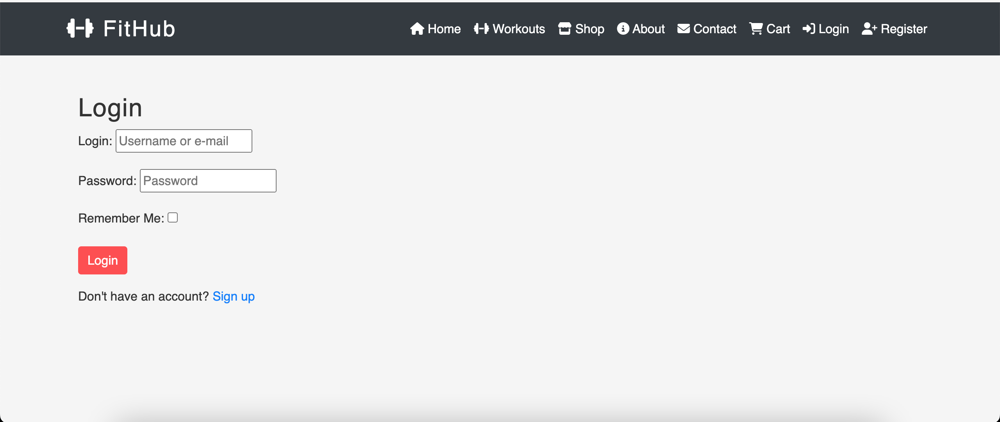

#### Email Verification
- New users receive verification email upon registration
- Accounts must verify email before accessing premium features
- Verification links expire for security

#### Secure Account Management
- Users can update profile information
- Change password functionality
- Secure session management
- Logout option available from navigation

---

### Payments app

#### Premium Access Purchase
- Users can purchase monthly premium subscription for €19.99
- Premium checkout page displays plan details and benefits
- One-click payment via Stripe

    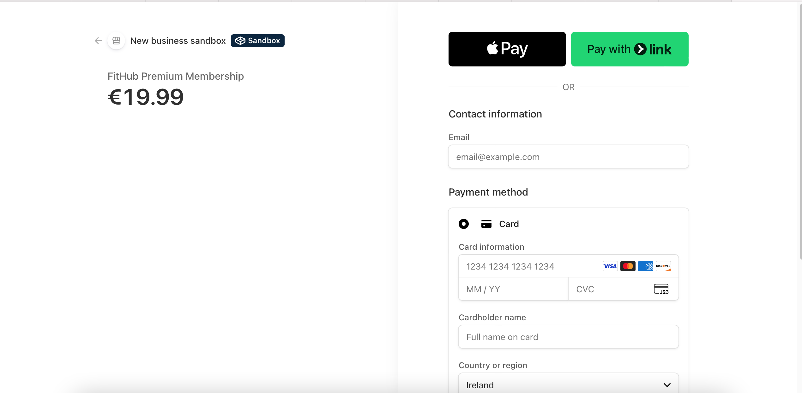

#### Secure Checkout
- Stripe handles all payment processing (PCI compliant)
- Users never enter payment details on FitHub servers
- Test mode available for development

#### Payment Validation
- Payment success redirects to confirmation page
- Premium status activated immediately after successful payment
- Admin can manually manage premium status via admin panel

    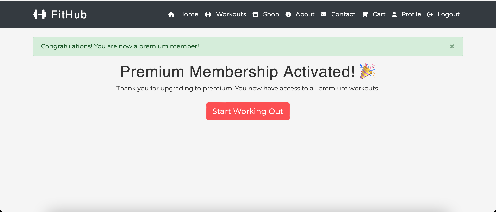

---

### Shop app

#### Browse Products
- All products displayed in responsive grid layout
- Each product shows: image, name, price, and stock status
- Low stock warning appears when inventory is low (<10 units)
- Out of stock products are clearly marked

    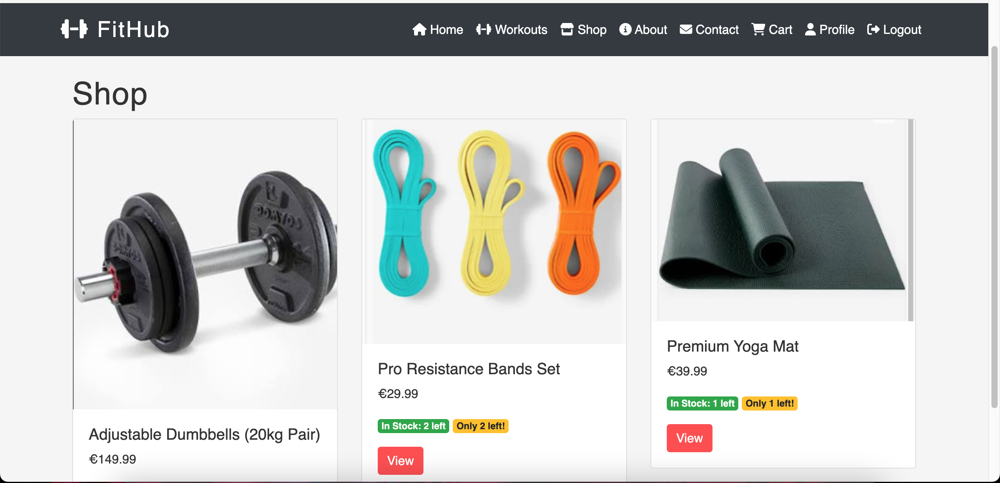

#### Product Details
- Click any product to view detailed information
- Page shows: full description, price, stock availability
- Quantity selector with stock limit validation
- Add to cart button with visual feedback

    

#### Shopping Cart
- Add/remove products from cart
- Update quantities with +/- buttons (AJAX)
- Real-time total price calculation
- Cart persists in session for guest users
- Stock validation prevents over-purchasing

    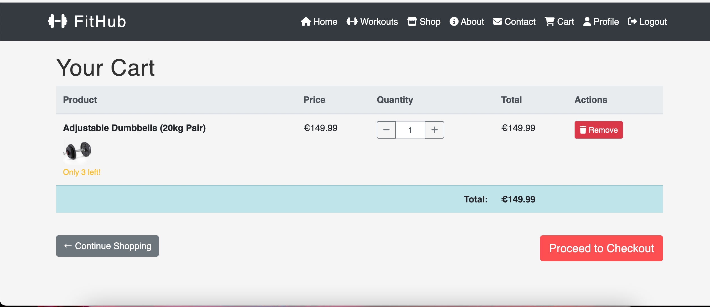

#### Checkout Process
- Delivery address collection before payment
- Form includes: name, email, phone, address, city, postal code, country
- Order summary shows all items and total
- Login required before checkout

    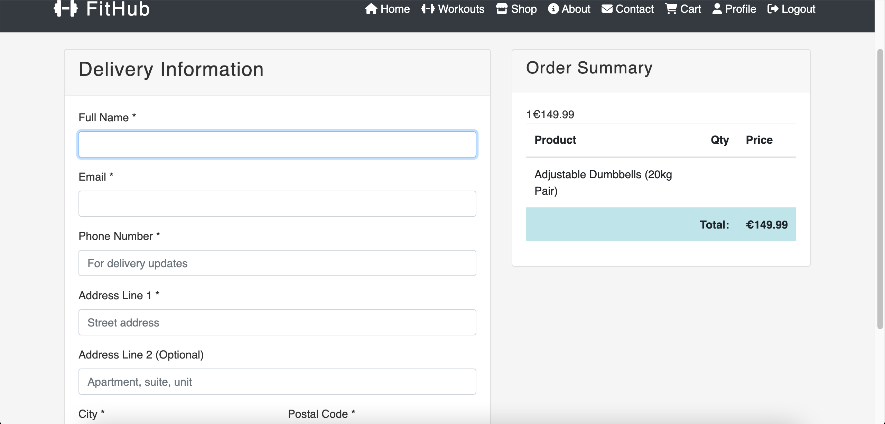

#### Order Confirmation
- Users receive order confirmation on success page
- Order details saved to database
- Admin can view all orders in admin panel
- Stock automatically reduced after purchase

    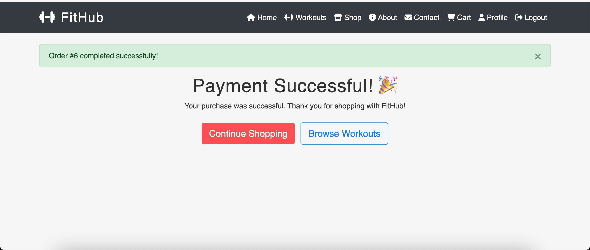

---

### Profile app

#### User Profiles
- Each registered user has a dedicated profile page
- Profile displays: username, bio, profile image, premium status
- Users can upload profile picture
- Bio text area for personal description

    

#### Premium Status Tracking
- Profile clearly shows if user has premium access
- Premium badge displayed for subscribers
- Upgrade button shown for non-premium users
- Premium status unlocks premium workout content

#### Edit Profile
- Users can update their bio and profile image
- Form validates image uploads
- Changes reflect immediately on profile page

    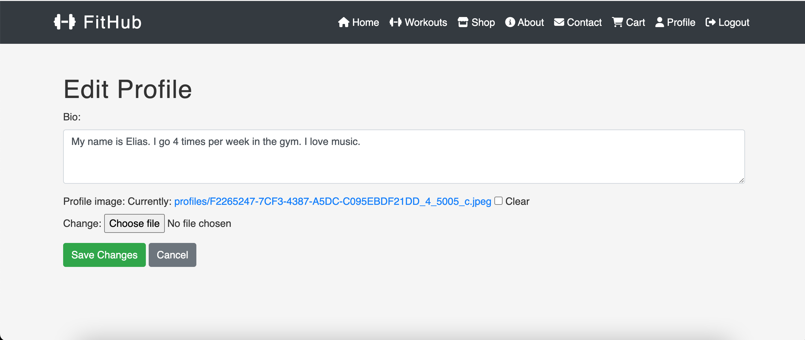

---

### Admin Management

#### Product Management
- Admin can add, edit, and delete products via Django admin
- Stock levels can be updated from product list
- Low stock warning column highlights products needing restock
- Product images upload to AWS S3

#### Order Management
- View all customer orders with details
- Filter orders by paid status and date
- See which products were ordered
- Customer delivery addresses visible

#### Premium User Management
- View all users and their premium status
- Manually grant or revoke premium access
- Filter users by premium status
- Search users by username or email

#### Delivery Address Management
- View all customer delivery addresses
- Addresses include full name, phone, and complete address
- Created timestamp for reference
- Search deliveries by customer name or city

    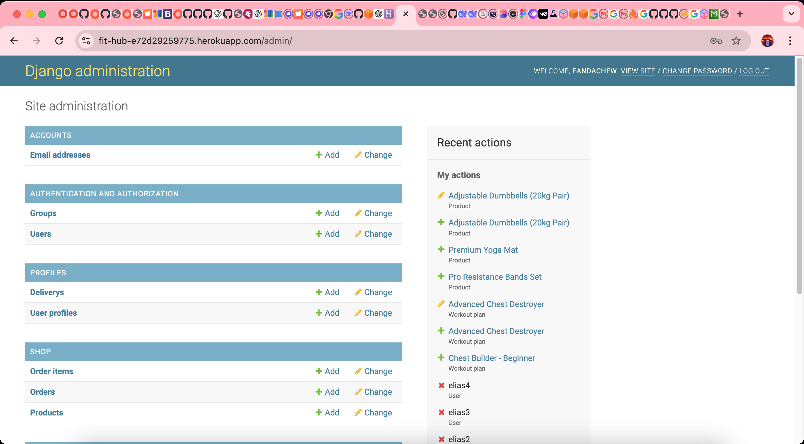

---

### Pages app

#### About Page
- Learn about FitHub platform
- Describes services offered: workouts, shop, premium content
- Subscription benefits explained
- Responsive and readable on all devices

    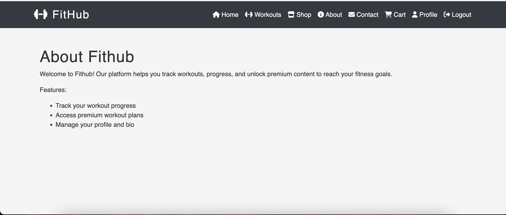

#### Contact Form
- Users can send messages to site owner
- Form fields: name, email, message
- Email notification sent to admin via Gmail SMTP
- Success message displayed on submission

    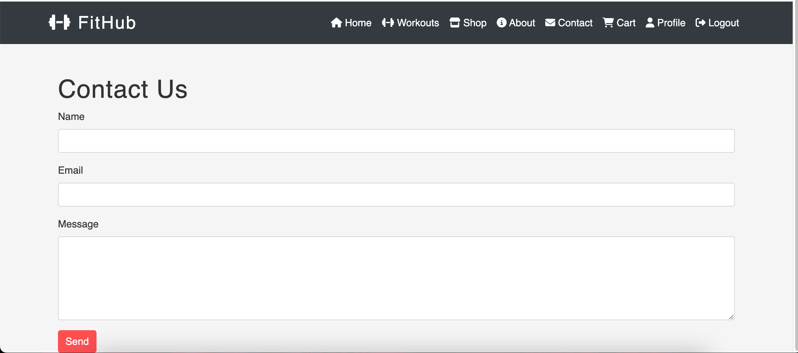

---
## Testing

- #### Testing.
  - The testing section for this site is located at the following link.
    - [Testing file](TESTING.md)