# Testing
## Table of contents.

## User Stories.
- As a visitor, I want to view a detailed workout plan, So that I can understand the exercises included.
 
**Acceptance Criteria** 
- Acceptance criteria 1: Clicking a workout plan opens the full plan page.
 
 
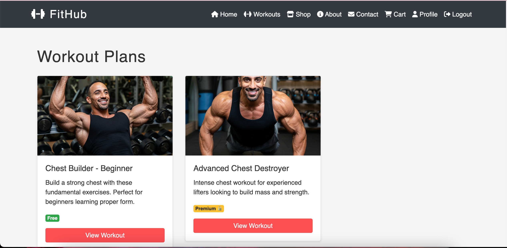

- Acceptance criteria 2: The page displays:

    -title

    -difficulty level

    -description

    -list of exercises

- Acceptance criteria 3: Premium workouts show a locked message for non-subscribers.

 

- The website has numerous references to fitness and exercise throughout (hero section, features section, premium offerings).

- The workouts page displays all available workout plans with clear visual distinction between free and premium content.

- Each workout card on the listing page includes a "View Details" button or clickable area that leads to the full workout plan page.

- The detailed workout page provides comprehensive exercise breakdowns including exercise name, sets, reps, and rest periods.

- Premium workout plans display a locked message for non-premium users, encouraging upgrade while still showing basic information like title and difficulty.

- The page includes visual progress indicators (where applicable) so users can track completion of exercises within a workout.

- Navigation between the workouts listing and individual workout pages is consistent with the rest of the site's navigation patterns.

---

- As a subscribed user, I want to access premium workouts, So that I can benefit from advanced training plans.
 
**Acceptance Criteria** 
- Acceptance criteria 1: Only users with an active subscription can view premium workouts.
- Acceptance criteria 2: Non-subscribed users see a subscription prompt.
- Acceptance criteria 3: Backend verification prevents bypassing access. 

The website clearly labels which workouts are Premium vs Free throughout the workouts listing page.

Premium workout cards display a crown icon or "Premium" badge to indicate restricted content.

Non-subscribed users who click on a premium workout see a subscription prompt with a link to upgrade.

Subscribed users can view full premium workout details without any restrictions or locked messages.

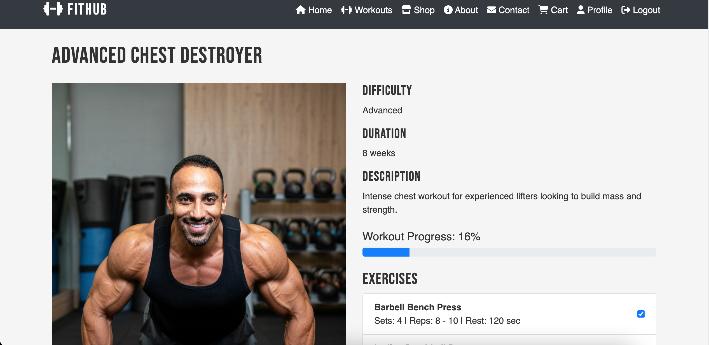

The backend verifies subscription status on every premium workout request to prevent URL guessing or direct access bypass.

---

- As a registered user, I want to purchase a monthly subscription, So that I can access premium workout plans.
 
**Acceptance Criteria** 
- Acceptance criteria 1: Subscription page displays plan details and price.
- Acceptance criteria 2: Users are redirected to Stripe checkout.
- Acceptance criteria 3: Successful payment activates the subscription.
- Acceptance criteria 4: Premium workout plans become accessible.
 

- The subscription page clearly displays plan features (unlimited workouts, progress tracking, exclusive content) alongside the €19.99/month price.

- Users are redirected to Stripe's secure checkout page for payment processing.

- Successful payment automatically activates the user's premium subscription status in the database.

- Once subscribed, premium workout plans become immediately accessible without requiring re-login.

- The home page features a "Go Premium Today!" call-to-action section for non-premium users.

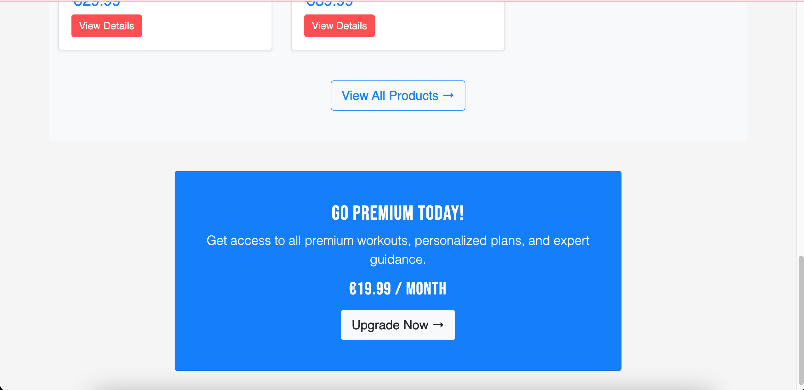

---
- As a registered user, I want to mark workouts as completed, So that I can track my fitness progress. 
 
**Acceptance Criteria** 
- Acceptance criteria 1: Users can mark workouts as completed.
- Acceptance criteria 2: Completion status is saved in the database.
- Acceptance criteria 3: Progress displays on the user dashboard.
 
 - Each exercise within a workout plan has a checkbox or "Mark Complete" button next to it.

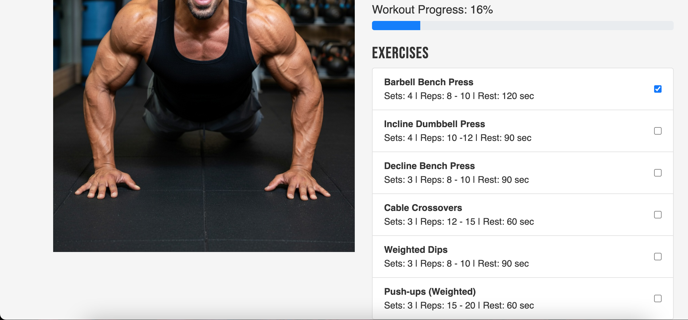

- Users can mark individual exercises or the entire workout as completed with one click.

- Completion status is saved to the database and persists across browser sessions.

- The user dashboard displays overall progress including completed workouts and completion percentage.

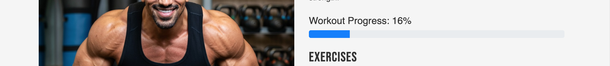

---
- As a registered user, I want to log into my account, So that I can access my profile, workouts, and purchases.
 
**Acceptance Criteria** 
- Acceptance criteria 1: Login form is accessible.
- Acceptance criteria 2: Correct credentials log the user in.
- Acceptance criteria 3: invalid credentials show an error message.
- Acceptance criteria 4: User is redirected to their dashboard or homepage.

- The login form is accessible via a "Login" link in the main navigation bar.

- Correct email/username and password credentials successfully log the user into their account.

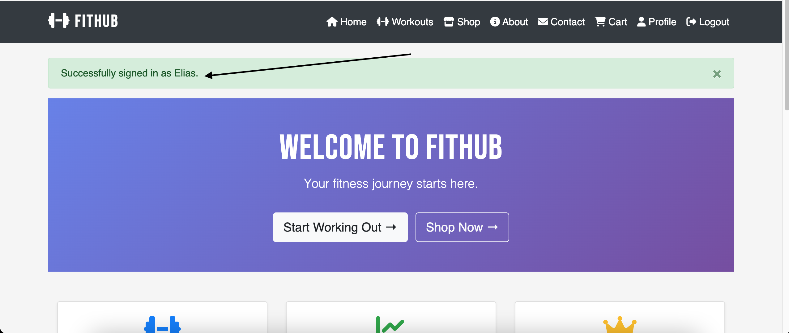

- Invalid credentials display a clear error message (e.g., "Invalid username or password").

- After successful login, users are redirected to their dashboard or back to the page they were viewing.

- The navigation bar updates to show the logged-in user's name and a logout option.

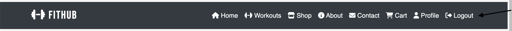

---

As a registered user,   
As a registered user, I want to see my workout progress, So that I can monitor my improvement.
 
**Acceptance Criteria** 
- Acceptance criteria 1: Dashboard displays:

    -Completed workouts

    -Total workouts

    -Completion percentage

- Acceptance criteria 2: Progress updates dynamically.

- The user dashboard displays completed workouts count and total available workouts.

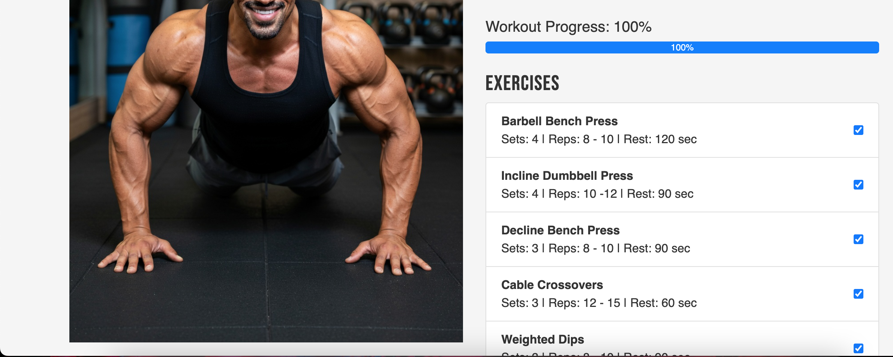

- A visual progress bar or percentage indicator shows overall completion rate.

---

- As a visitor, I can register for an account, so that I can track my fitness progress and access premium content. 
 
**Acceptance Criteria** 
- Acceptance criteria 1: Registration form is available.
- Acceptance criteria 2: Valid detail create a new user account.
- Acceptance criteria 3: A profile and Subscription record are automatically created.
- Acceptance criteria 4: Users is redirected to the homepage after successful registration.

- The registration form is accessible via a  "Register" link in the main navigation.

- Valid registration details (username, email, password) create a new user account in the system.

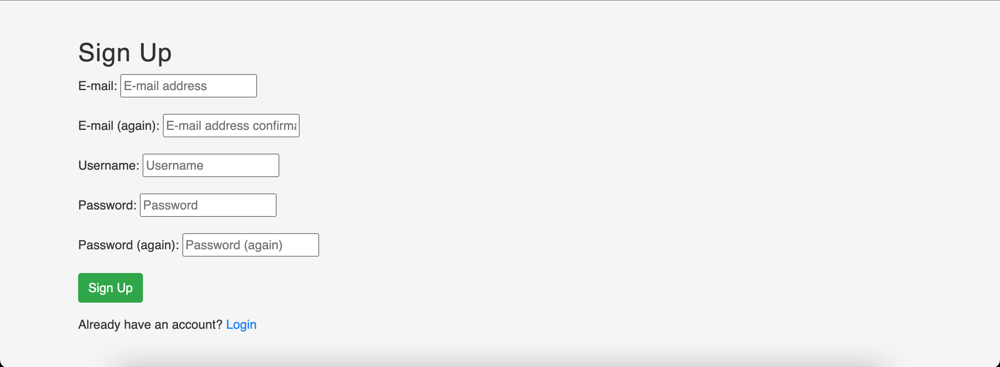

- user will be asked for confirmation email.

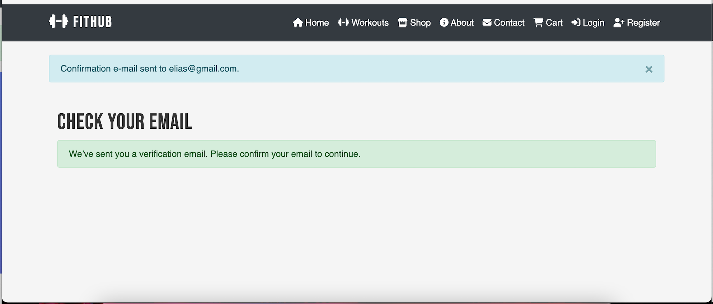

- The registration form includes validation for password strength and matching confirmation.

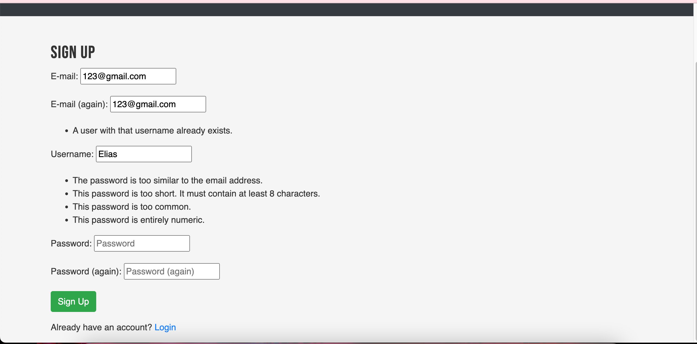

- Users are redirected to the homepage or dashboard after successful registration.

---
 
As a visitor, I want to contact the platform owner, so that I can ask questions or report issues. 
 
**Acceptance Criteria** 
- Acceptance criteria 1: Contact form is accessible.

- Acceptance criteria 2: Form includes:
    - Name
    - Email
    - Message

- Acceptance criteria 3: Form submission sends the message successfully.

- The contact form is accessible "Contact" page link.

- The form includes required fields: Name, Email Address, and Message.

- Successful form submission displays a confirmation message (e.g., "Your message has been sent successfully!").

- Email address field validates proper email format before submission.

---

- As a visitor, I want to learn about the platform, So that I understand what services FitHub offers.
 
**Acceptance Criteria** 
- Acceptance criteria 1: About page is accessible from navigation.
- Acceptance criteria 2: Page describes:

    - Platform purpose

    - Services offered

    - Subscription benefits

- Acceptance criteria 3: Page is responsive and readable on all devices.

- The About page is accessible from the main navigation links.

- The page clearly describes FitHub's platform purpose (fitness tracking and workout plans).

- The page is fully responsive and readable on mobile, tablet, and desktop devices.
- mobile 
 
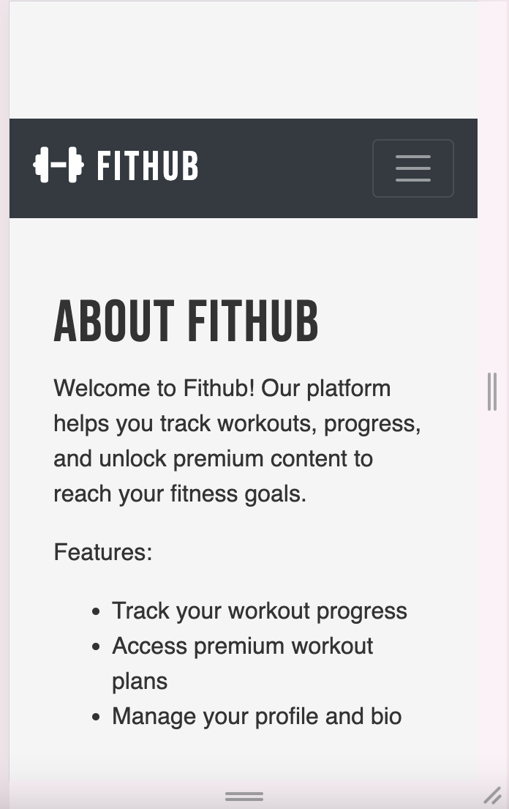

 - Tablet
 
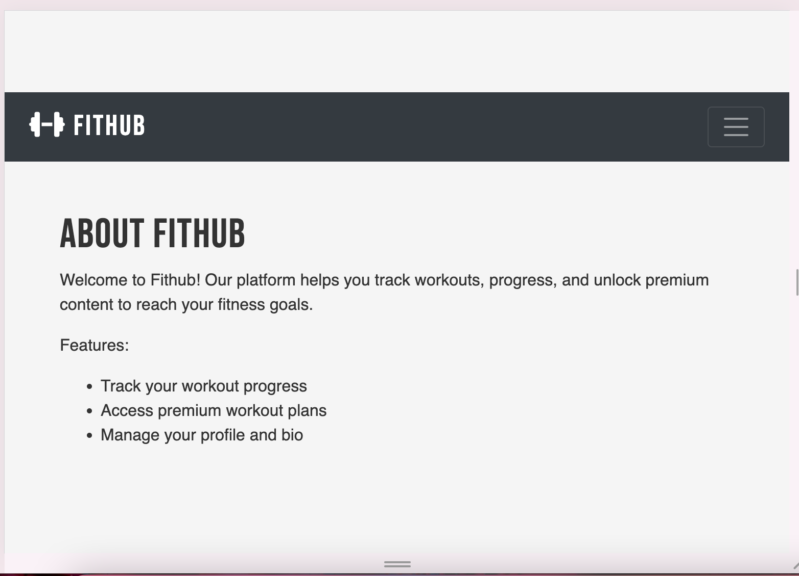

 - Desktop 
 

--- 

- As a registered user, I want to update my fitness profile, So that I can personalize my experience.

**Acceptance Criteria** 
- Acceptance criteria 1: Users can update:

    -picture

    -bio

- Acceptance criteria 2: Changes are saved to the database.

- Acceptance criteria 3: Profile updates immediately reflect on the profile page.

- Users can access their profile page from the navigation bar after logging in.

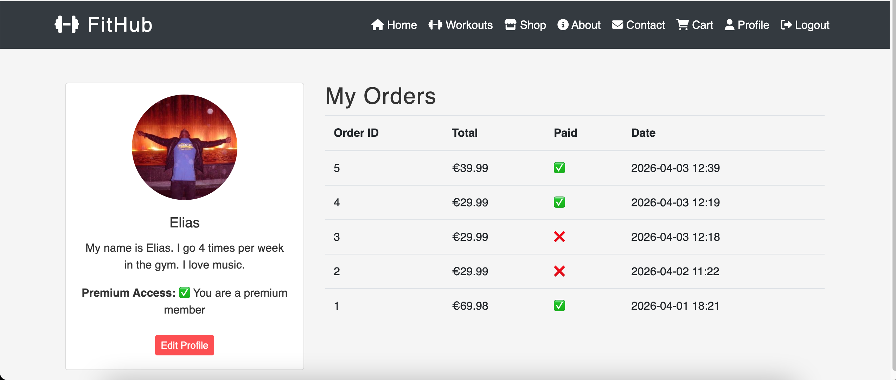

- Users can edit their bio/fitness bio (e.g., fitness goals, experience level).

- Changes are saved to the database when the user clicks "Save" or "Update Profile".

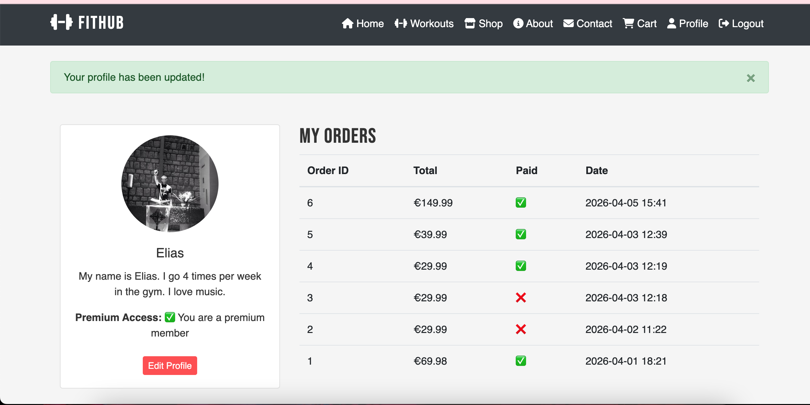

---
 

- As an admin, I want to manage digital products, So that I can sell fitness guides and resources.

**Acceptance Criteria** 
- Acceptance criteria 1: Admin can create products.

- Acceptance criteria 2: Admin can edit or remove products.

- Acceptance criteria 3: Products appear automatically in the shop.

- The admin has access to Django Admin panel or a custom admin dashboard.

- Admin can create new products with fields: name, description, price, image, and stock quantity.

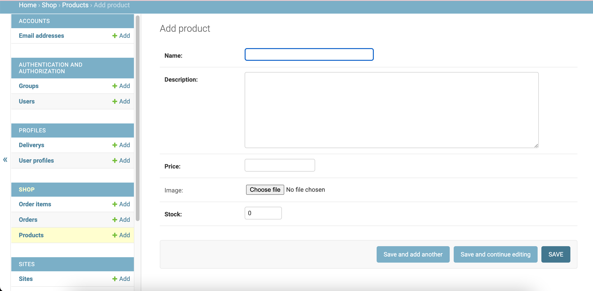

- Admin can delete or archive products that are no longer for sale.

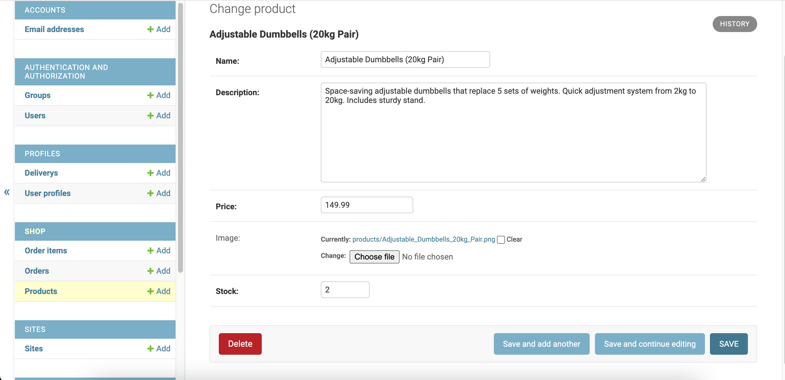

---

- As an admin, I want to create, edit, and delete workout plans, So that I can maintain the site’s content.

**Acceptance Criteria** 
- Acceptance criteria 1: Admin can manage workout plans via Django Admin.
- Acceptance criteria 2: Admin can add exercises to workouts.
- Acceptance criteria 3: Changes are reflected immediately on the site.

Admin can manage all workout plans through the Django Admin interface.

Admin can create new workout plans with title, difficulty, description, and premium status.

Changes made in Django Admin reflect immediately on the live site.

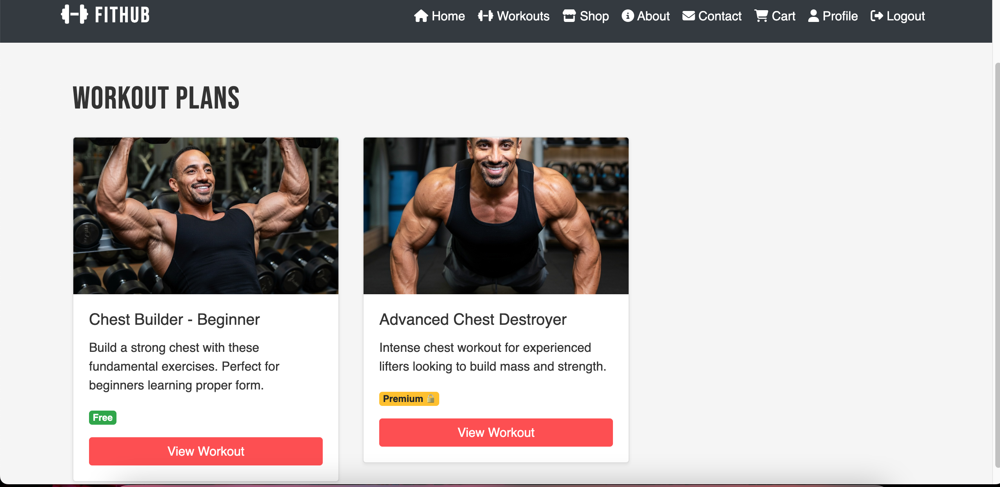

---

- As a visitor, I want to browse fitness products, So that I can purchase workout equipment and guides.

**Acceptance Criteria**
- Acceptance criteria 1: Shop page displays all available products
- Acceptance criteria 2: Products show image, name, price, and stock status
- Acceptance criteria 3: Products are displayed in a responsive grid layout
- Acceptance criteria 4: Users can click on products to view details

- The Shop page is accessible from the main navigation bar alongside Workouts and Home links.

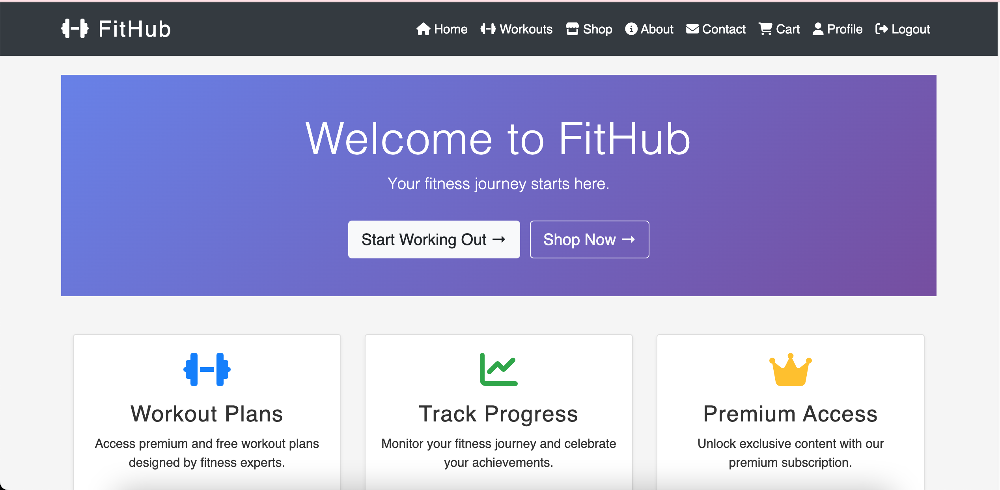

- All available products are displayed in a responsive grid layout and shows the product image, name, price, and stock status

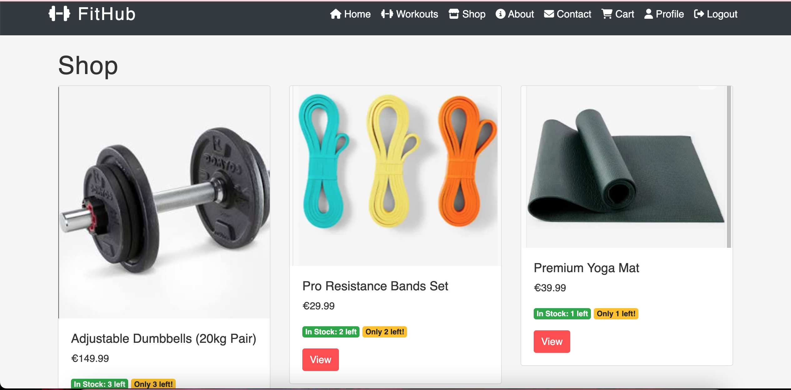

- Users can click on any product card to view detailed product information.

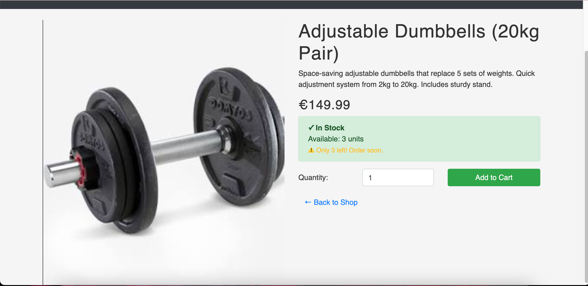

---

- As a user, I want to add products to my cart, So that I can purchase multiple items at once.

**Acceptance Criteria**
- Acceptance criteria 1: Products have an "Add to Cart" button
- Acceptance criteria 2: Cart shows quantity and total price
- Acceptance criteria 3: Users can update or remove items from cart
- Acceptance criteria 4: Cart persists in session for non-logged-in users.

- Every product on the shop page and product detail page has an "Add to Cart" button.

- The cart page displays all added products with quantities and individual prices.

- The cart shows a subtotal and total price that updates when quantities change and can update item quantities.

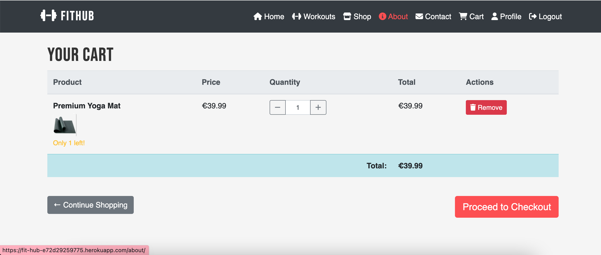

- Cart contents persist in the browser session for non-logged-in users and save to their account after login.

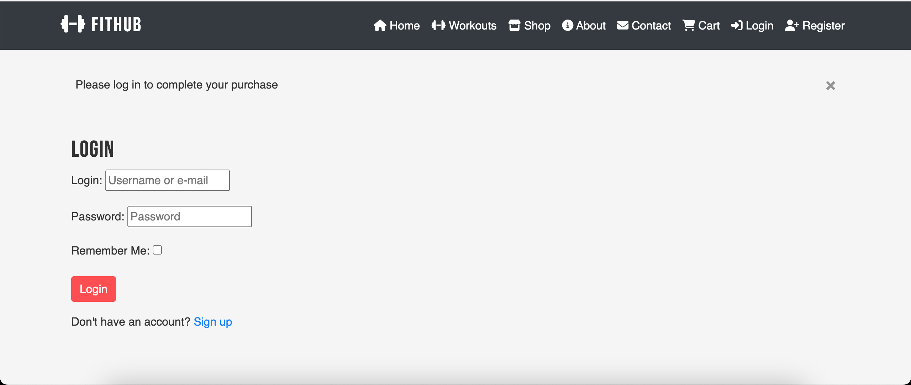

---

- As a customer, I want to enter my delivery address at checkout, 
So that my purchased items can be shipped to me.

**Acceptance Criteria**
- Acceptance criteria 1: Checkout process includes a delivery information form

- Acceptance criteria 2: Form requires full name, email, phone number, and address

- Acceptance criteria 3: Address fields include street, city, postal code, and country

- Acceptance criteria 5: Delivery information is saved before payment is processed

- The checkout process includes a dedicated delivery information form before payment and the form requires: full name, email address, phone number, and complete address details.

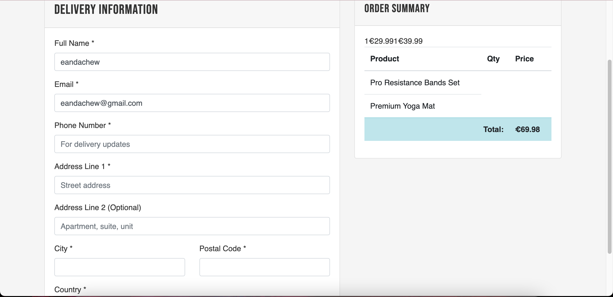

- Delivery information is validated and saved to the database before payment is processed and shown in the admin dashboard.

---

- As an admin, I want to see all customer orders, So that I can process and fulfills them.

**Acceptance Criteria**

- Acceptance criteria 1: Admin can view list of all orders with order numbers

- Acceptance criteria 2: Each order shows customer name, total amount, and date

- Acceptance criteria 5: Order details show which products were purchased

- Admin can view a complete list of all customer orders from Django Admin or a custom admin dashboard.
- The order list displays order numbers, customer names, total amounts, and order dates.

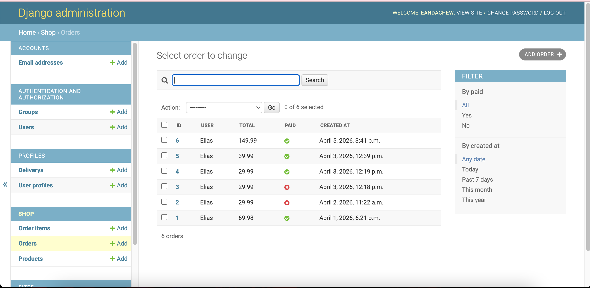

- Admin can click into individual orders to view detailed information.

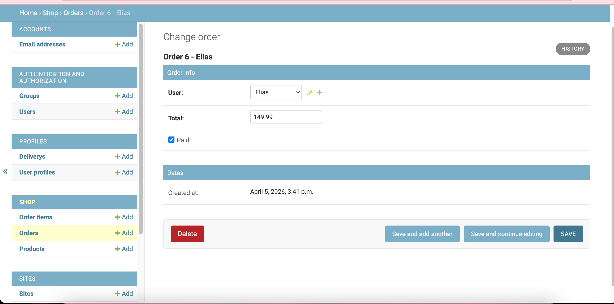

---

## Unit Testing 
- Each app was tested using Django unit testing.

- Tests were written to test the URLs, Models, Forms, and the Views.

- To run the tests in the terminal you can type the following command:

        
            python3 manage.py test
        

- To show how much of the app has been covered by the testing I used coverage.

- To use coverage first run:

        pip install coverage

- Then run to test the whole app:

        coverage run --source=abode manage.py test 
      
- Coverage generates a report to show how much of the code has been tested and how much is yet to be tested:

        coverage report

You can then run coverage HTML to show the report on the screen:

        coverage html
      

- To open the report you can run 
    
            python3 -m http.server
      
- I've included the reports for each app below.

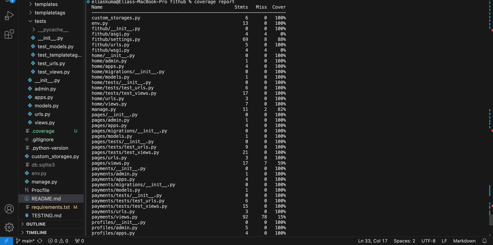
 
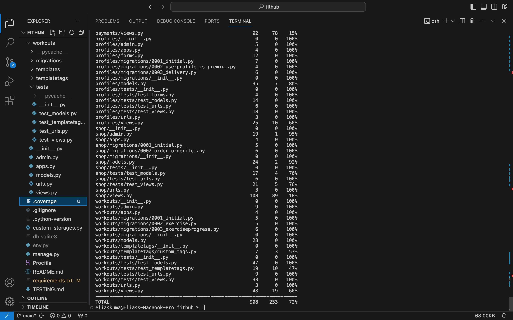
 
    
## Test and Bugs During Development

#### UnboundLocalError with completion_percent in Workout Detail View

- During development, I encountered an UnboundLocalError when testing the workout detail page.

The error occurred when a non-authenticated user (guest) tried to view a workout plan, or when a workout had no exercises.

The fix was to add completion_percent = 0 at the start of the workout_detail view function.

        Before 
        'completion_percent': completion_percent  

        After 
        completion_percent = 0 

#### CSRF Token Issues with JavaScript (AJAX)
While implementing AJAX for workout progress updates, POST requests initially failed.
The issue was due to missing CSRF token in fetch requests.

Fix:

Included CSRF token in headers:

    fetch("/update-progress/", {
        method: "POST",
        headers: {
            "X-CSRFToken": csrfToken,
        },
        body: formData
    })

#### Workout Detail View Error (NameError)
During development, I encountered an error when accessing the workout detail page:

        NameError: name 'workout' is not defined

The issue was caused by not properly passing the workout object into the template context.
Fix:
Ensured the workout variable was correctly defined in the view:

    workout = get_object_or_404(WorkoutPlan, id=workout_id)

## Manual Testing

All functionality of the website was also tested manually to ensure it all worked correctly.

### Workout Functionality

- To test the workout functionality I first navigated to the workouts page.
- I viewed the list of available workouts including both free and premium options.

  

- I then clicked on a free workout to view the detailed workout plan.
- The page displayed the workout title, description, difficulty level, duration, and list of exercises.

  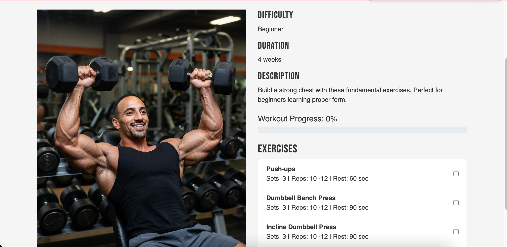

- I tested the exercise progress tracking by marking exercises as completed.
- The completion percentage updated dynamically to show my progress.

  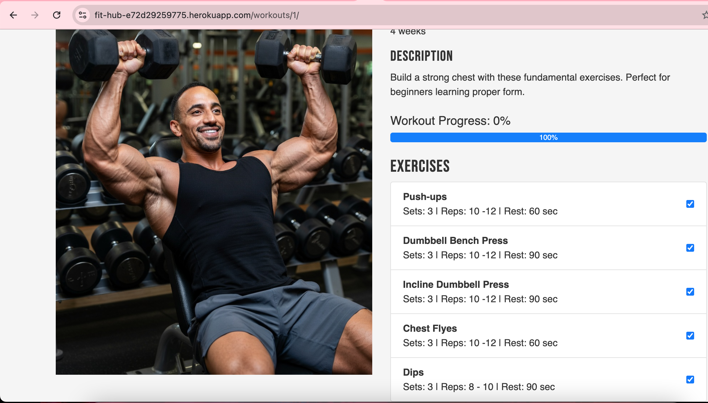

- When the page reloaded it changes to 100 percent 
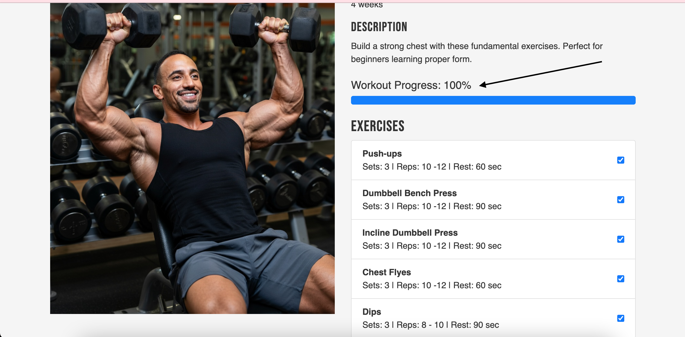

### Premium Workout Access

- To test premium workout restrictions I first logged out of my account.
- I attempted to click on a premium workout card.
- The page redirected me to the login page with a message: "Please login to access premium workouts."

  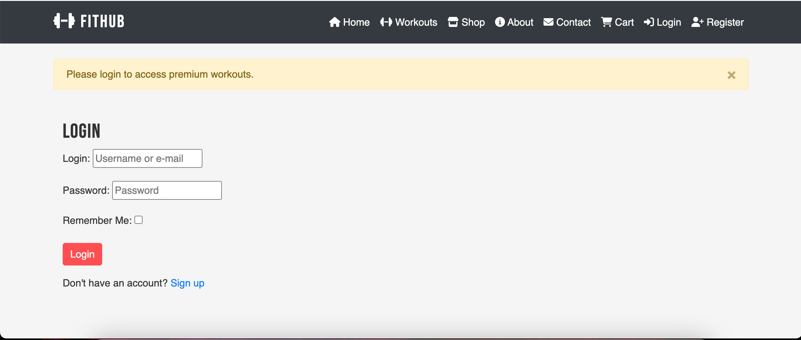

- I then logged in as a free user (non-premium subscriber) and tried to access a premium workout.
- The page showed a locked message: "You must purchase premium access to view this workout."
- A button appeared linking to the premium checkout page.

  

### Subscribe to Premium Plan

- To test the premium subscription functionality I first logged into my account.
- I navigated to the premium checkout page using the "Go Premium Today!" button on the homepage.

  

- I filled in the payment details using Stripe's test card number: `4242 4242 4242 4242`
- I entered any future expiration date, any CVC, and any postal code.

  

- After successful payment, I was redirected to a success page.
- I verified that my account now had premium access by checking my profile.

  

- I then tested accessing a premium workout again and could now view all exercises without any locked message.

  

### Shop Product Browsing

- To test the shop functionality I first navigated to the shop page from the navigation bar.
- All products displayed in a responsive grid layout showing image, name, price, and stock status.

  

- I clicked on a product to view its detailed information.
- The product detail page showed full description, price, stock status, and an "Add to Cart" button.

  

### Cart Functionality

- To test the cart functionality I first added an item to the cart using the "Add to Cart" button.

  

- I then navigated to the cart page to view my items.
- The cart displayed the product name, quantity, price, and subtotal.

  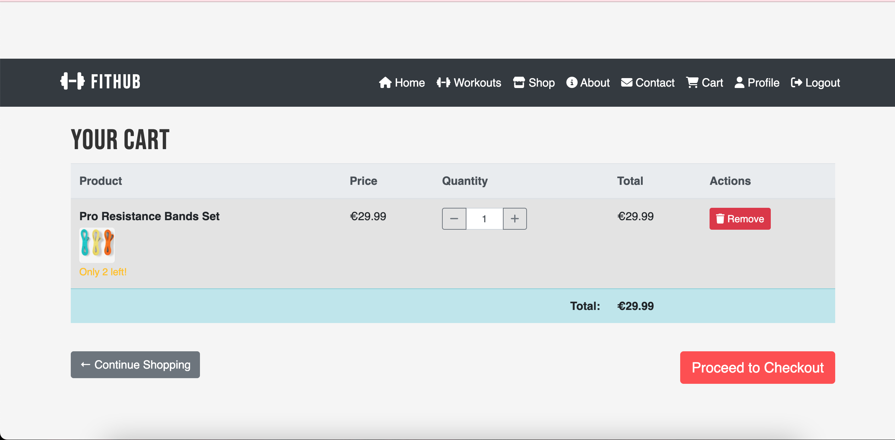

- I tested updating the quantity by changing the number in the quantity field.
- The cart total updated automatically.

  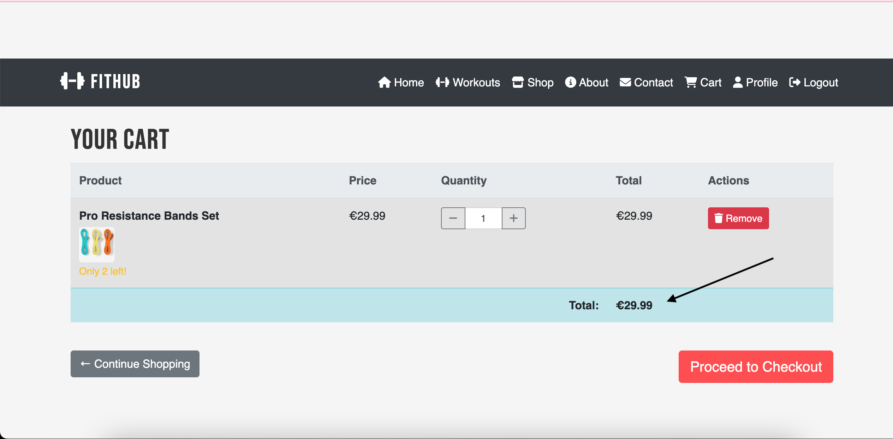

- I then removed an item from the cart using the remove button.
- The item was successfully removed and the cart updated.

  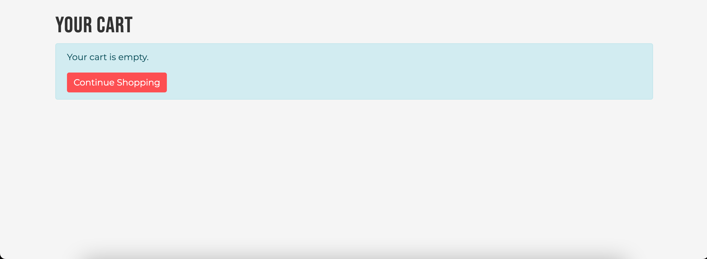

### Checkout Functionality

- To test the checkout functionality I first added an item to my cart and navigated to the checkout page.
- I filled in the delivery information form including name, email, phone, address, city, postal code, and country.

  

- I entered the Stripe test card number `4242 4242 4242 4242` for payment.
- I submitted the order and received an order confirmation page.

  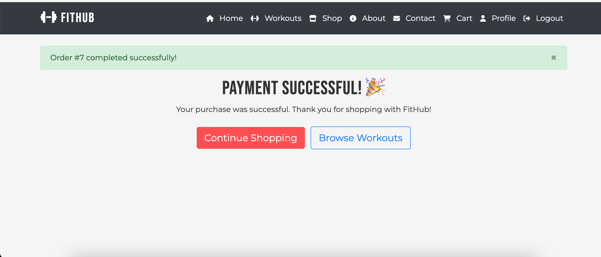

- I logged into Stripe dashboard to verify the payment intent succeeded.

  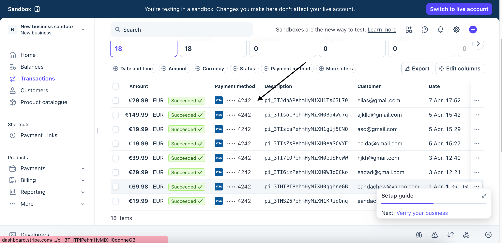

- Finally, I checked the Django admin panel to ensure the order had been saved correctly.

  

### User Account Functionality

- To test user registration I navigated to the sign-up page.
- I filled in the registration form with username, email, and password.

  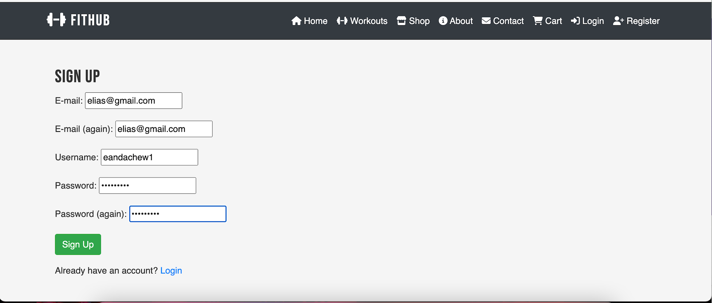

- After submitting, I was redirected to the homepage and logged in automatically.
- I tested the login functionality by logging out and logging back in with my credentials.

  

- I tested invalid credentials and received an error message.

  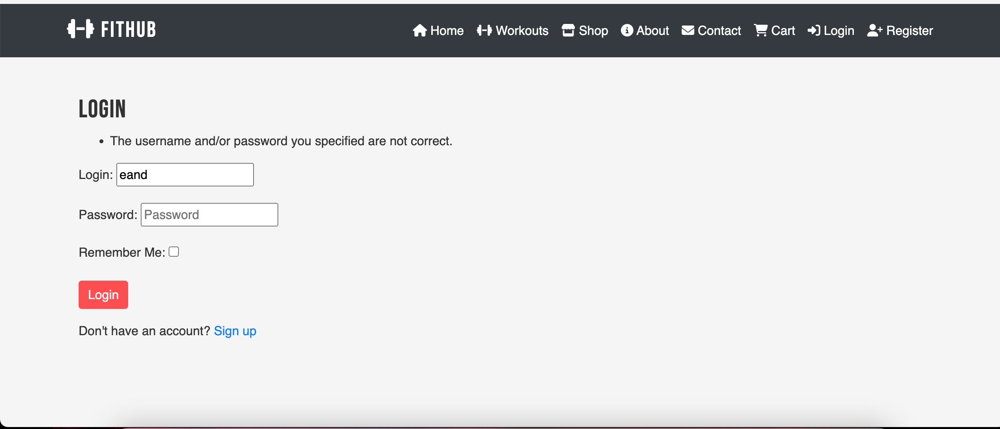

### Profile Management

- To test profile functionality I first logged into my account.
- I navigated to my profile page using the profile link in the navigation bar.

  

- I tested updating my profile picture and bio.
- I clicked save and verified the changes reflected immediately.

  

### Dashboard and Progress Tracking

- I navigated to my dashboard to view my fitness progress.
- The dashboard displayed:
    - Completed workouts count
    - Completion percentage with progress bar

  

### Contact Form

- To test the contact form I navigated to the contact page,
- I filled in the form with my name, email address, and message.

  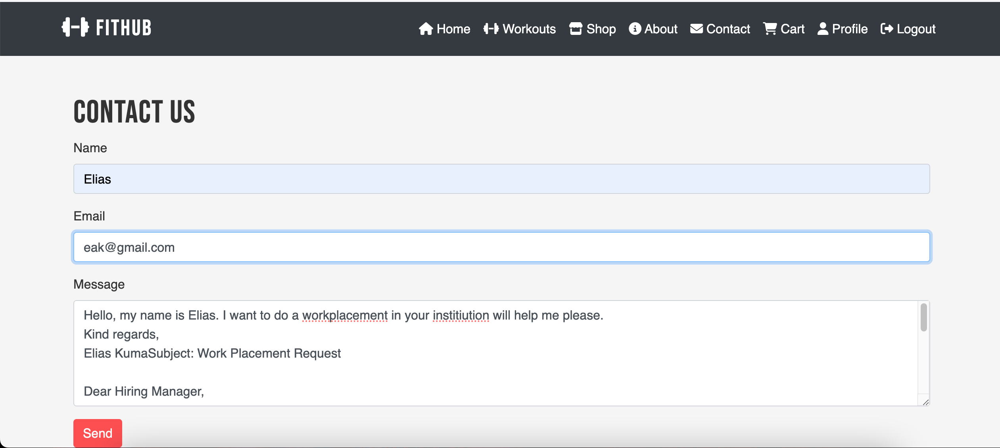

- I submitted the form and received a success message.
- I then logged into the admin panel to verify the contact message had been received.

  

### About Page

- I tested the about page by clicking the "About" link in the navigation.
- The page loaded correctly and displayed information about FitHub's purpose, services, and subscription benefits.

  

### Admin Product Management

- To test admin product management I first logged into the Django admin panel as a superuser.
- I navigated to the Products section under the Shop app.

  

- I tested creating a new product with name, description, price, image, and stock quantity.

  

- Finally, I tested deleting a product from the admin panel.

  

### Admin Workout Management

- To test admin workout management I logged into the Django admin panel.
- I navigated to the Workout Plans section under the Workouts app.

  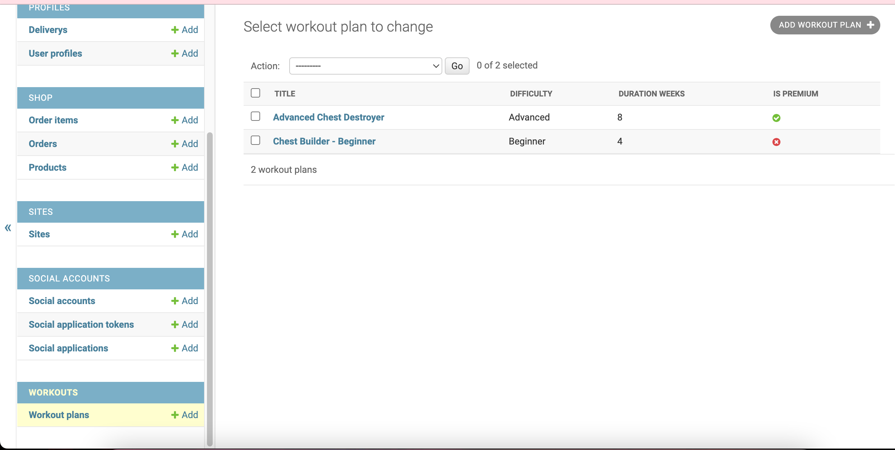

- I tested creating a new workout plan with title, description, difficulty, duration, and premium status.
- I also added exercises to the workout including name, sets, reps, and rest time.

  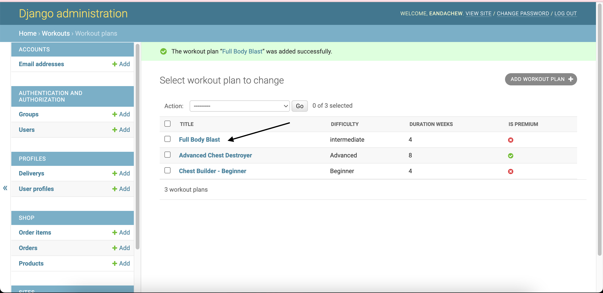

- I tested editing an existing workout and its exercises.
- I verified the changes appeared immediately on the live site.

  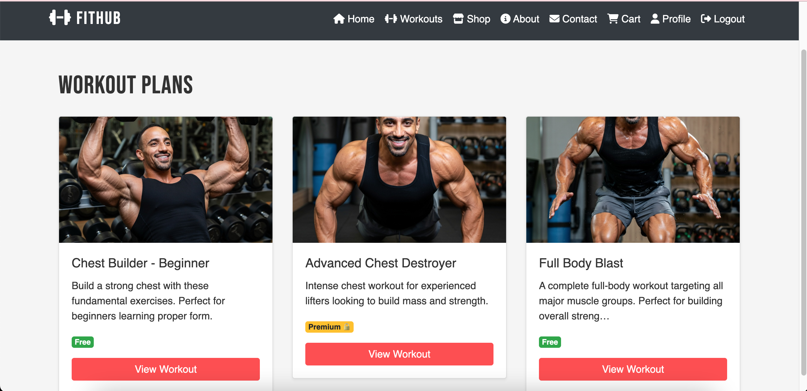

- I delete it after verfication.

### Admin Order Management

- To test admin order management I logged into the Django admin panel.
- I navigated to the Orders section to view all customer orders.
- Each order showed the order number, customer name, total amount, date, and status.

  

- I clicked into an order to view the detailed information including which products were purchased.

  

